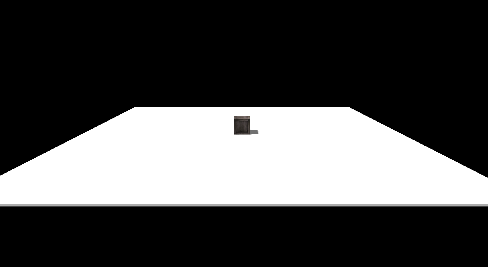
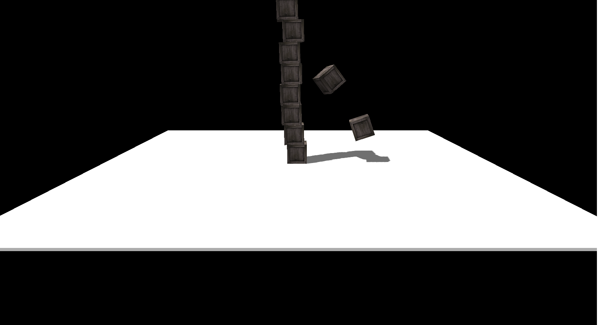
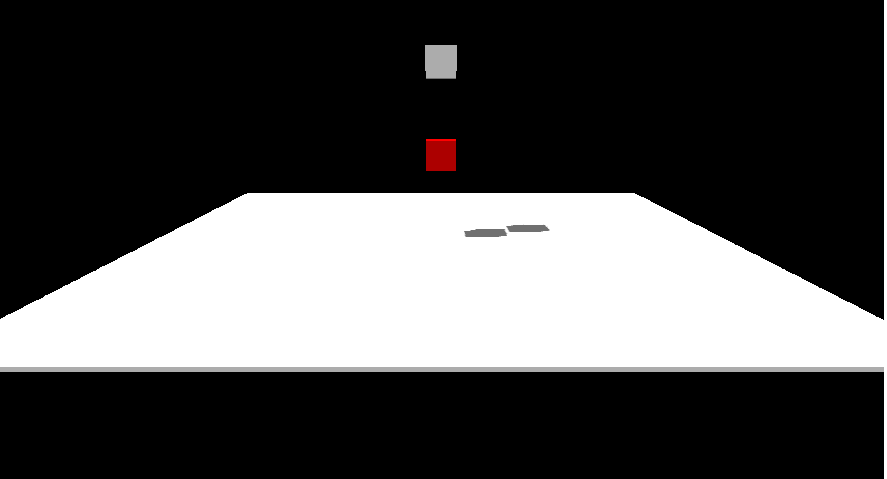
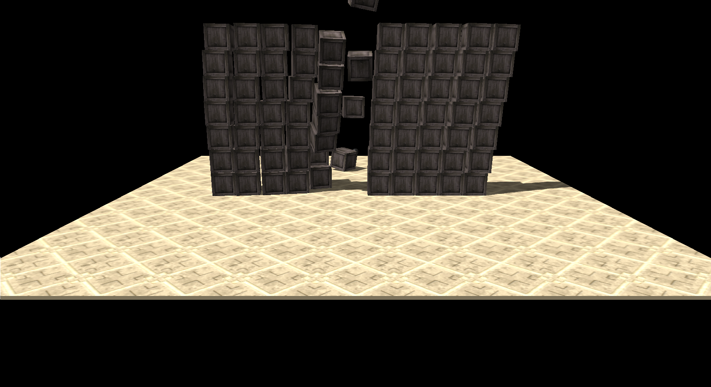
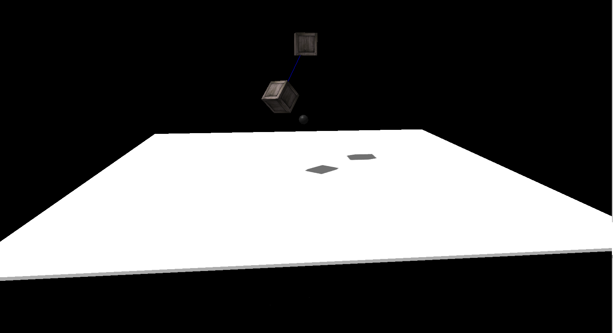
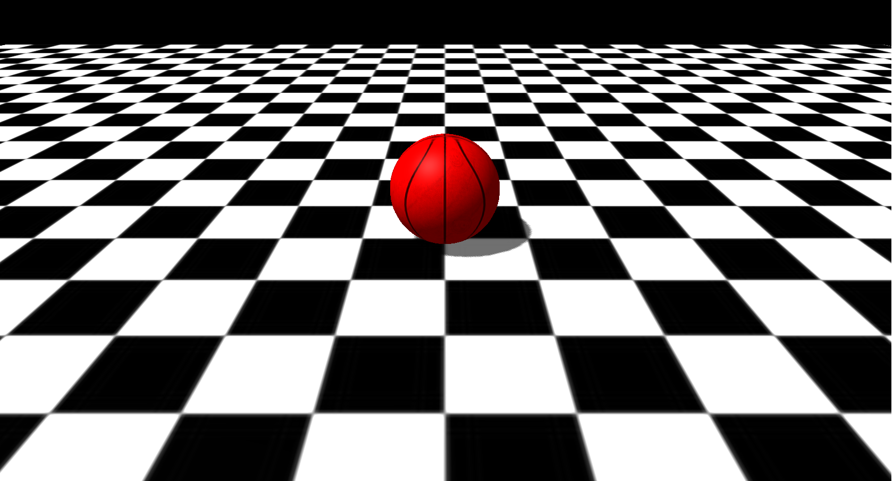
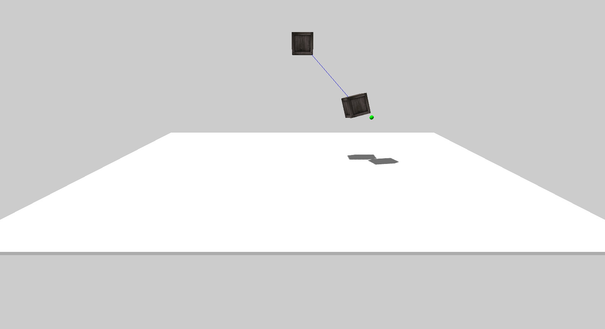

# Physijs_Tutorials
A set of tutorials to get started with the latest Physijs library.
Library version used:
Physijs: Latest
Three.js v 80

Demo Screenshots
================
Here are a few snapshots of the tutorial demos.

Simple Box: Shows how to add a single rigid body - [Live Demo](https://rawgit.com/mmmovania/Physijs_Tutorials/master/SimpleBox.html)

Multiple Boxes: Shows how to add multiple rigid bodies - [Live Demo](https://rawgit.com/mmmovania/Physijs_Tutorials/master/MultipleBoxes.html)

Simple Raycast: Shows how to identify objects through raycast into the world - [Live Demo](https://rawgit.com/mmmovania/Physijs_Tutorials/master/SimpleRaycast.html)

Shooting: Showing how to handle keyboard events to launch projectile in the viewing direction for shooting boxes - [Live Demo](https://rawgit.com/mmmovania/Physijs_Tutorials/master/Shooting.html)

Simple Joint: Shows how to add a simple point to point constraint - [Live Demo](https://rawgit.com/mmmovania/Physijs_Tutorials/master/SimpleJoint.html)

Simple Ball: Showing how to create rolling ball physics - [Live Demo](https://rawgit.com/mmmovania/Physijs_Tutorials/master/SimpleBall.html)

Picking: Shows how to handle mouse events to pick a rigid body - [Live Demo](https://rawgit.com/mmmovania/Physijs_Tutorials/master/Picking.html)

